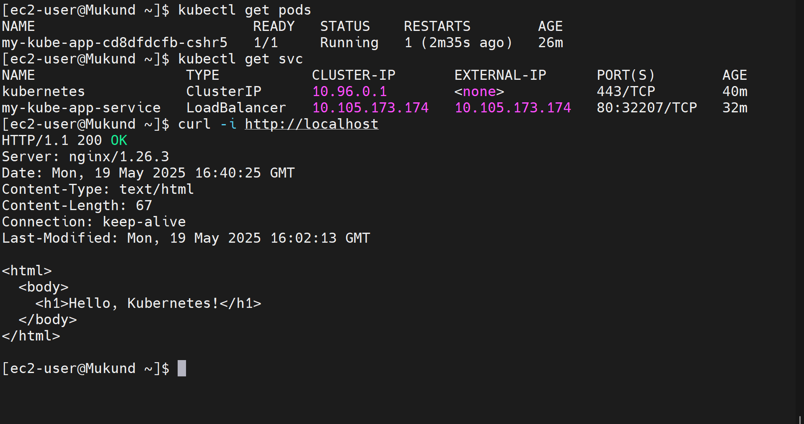
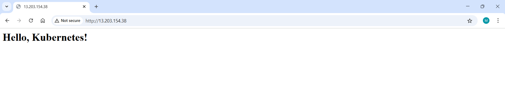

# Kubernetes Deployment with Minikube
## Task-5
---

This repository contains the deployment of a Python-based web application using **Kubernetes** on a local **Minikube** cluster. The app serves a static HTML page and demonstrates core Kubernetes concepts like **Deployments**, **Services**, and **Pod scaling**.

---

## Files Included

├── screenshots/ <br>
├── Dockerfile <br>
├── index.html <br>
├── deployment.yaml <br>
├── service.yaml <br>
└── app.py 

---

## Tools & Technologies

-  Docker
-  Kubernetes
-  Minikube
-  Python 3.9
-  kubectl

---

## How to Run This Project

### 1. Start Minikube

```bash
minikube start
```

### 2. Build the Docker Image

```bash
docker build -t my-kube-app:v1 .
```

### 3. Deploy the Application to Kubernetes

```bash
kubectl apply -f deployment.yaml
```

### 4. Expose the Deployment using a LoadBalancer Service

```bash
kubectl apply -f service.yaml
```

### 5. Access the Web Application

```bash
minikube service my-kube-app-service
```

**Expected output in browser**:
```
Hello, Kubernetes!
```

---

## Kubernetes Commands Used

```bash
kubectl get pods
kubectl get svc
kubectl describe pod <pod-name>
kubectl logs <pod-name>
kubectl scale deployment my-kube-app --replicas=3
```

---

## Screenshots

### 1. Terminal Output :



### 2. Browser Output :



---


# 📘 Interview Questions & Answers – Kubernetes Basics

### 1. What is Kubernetes?
**Kubernetes** is an open-source container orchestration platform. It automates deployment, scaling, and management of containerized applications.

---

### 2. What is the role of kubelet?
The **kubelet** is an agent that runs on each node in the Kubernetes cluster. It ensures that containers described in PodSpecs are running and healthy.

---

### 3. Explain pods, deployments, and services.

- **Pod**: The smallest deployable unit in Kubernetes. It can contain one or more containers.
- **Deployment**: A controller that manages ReplicaSets and ensures the desired number of pods are running.
- **Service**: An abstraction that defines a logical set of pods and a policy to access them.

---

### 4. How do you scale in Kubernetes?
Scaling is done by:
- **Manual scaling**: `kubectl scale deployment <name> --replicas=<number>`
- **Auto-scaling**: Using Horizontal Pod Autoscaler based on CPU or custom metrics.

---

### 5. What is a namespace?
A **namespace** provides a scope for Kubernetes objects. It is useful for dividing cluster resources among multiple users or teams.

---

### 6. Difference between ClusterIP, NodePort, LoadBalancer.

| Type         | Description |
|--------------|-------------|
| ClusterIP    | Default; accessible only within the cluster. |
| NodePort     | Exposes the service on each Node’s IP at a static port. |
| LoadBalancer | Exposes the service externally using a cloud provider's load balancer. |

---

### 7. What are config maps?
**ConfigMaps** allow you to decouple configuration artifacts from image content. They are used to store non-confidential configuration data as key-value pairs.

---

### 8. How do you perform rolling updates?
**Rolling updates** are done using Deployments. They gradually replace old pod versions with new ones using:
```bash
kubectl set image deployment/<name> <container>=<new-image>
```
This ensures zero downtime during application updates.
